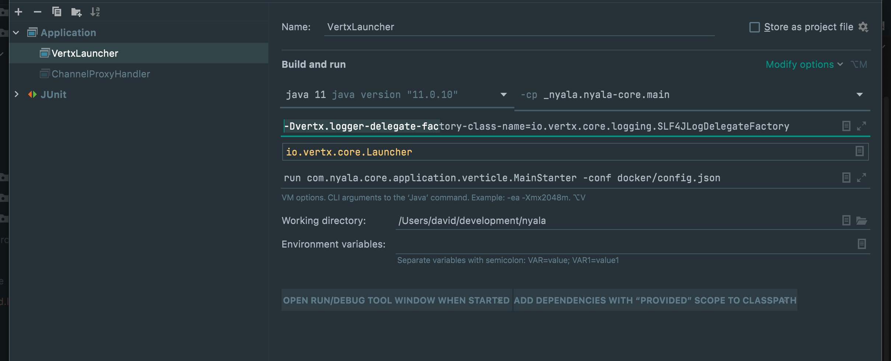

# Nyala

Nyala is template project to develop microservices or distributed monoliths with Vert.x, 
using Kotlin and Java.

Run tests:

```
./gradlew clean test
```

Build fatJar:
```
java -jar \ 
-Dvertx.logger-delegate-factory-class-name=io.vertx.core.logging.SLF4JLogDelegateFactory \
nyala-core/build/libs/nyala-core-1.0.0.jar run com.nyala.core.application.verticle.MainStarter \
-conf docker/config.json
```

Status endpoint:
```
http://localhost:9014/_status
```

Main endpoint:
```
curl -i -XPOST http://localhost:9014/channels
```
## Use Vert.x Launcher in IDEA



## Main components 

- Kotlin use (ongoing)
- Multiple Verticles deployment with isolated Dependency Injection graphs using Koin
- Communication with Redis (static endpoint)
- RxJava 2 (ongoing)
- Reactive Process output reading using RxJava
- OAuth2 factory (using Google libraries/apps)